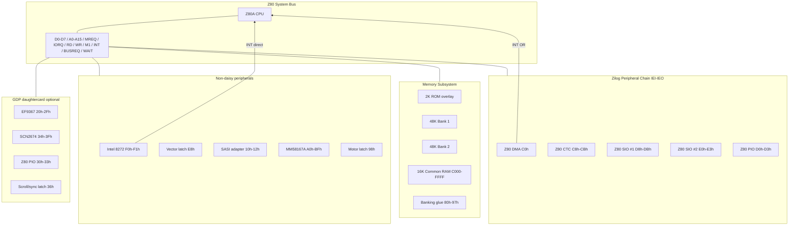

# Iskra Delta Partner — Z80 Board Schematics (Emulator-Derived)

_Tomaz Stih, 2026_

This document is a **reverse-engineered schematic reference** derived from the
`idp-emu` emulator and firmware traces. It is intended for KiCad (or similar)
board design that is **behavior-compatible** with the Partner family. It is
**not** a scan of original Iskra Delta factory drawings.

Companion references:

- [PARTNER-COMPLETE-REFERENCE.md](PARTNER-COMPLETE-REFERENCE.md) — programmer view
- [../notes/patterns/INTERRUPT-IM2-DAISYCHAIN.md](../notes/patterns/INTERRUPT-IM2-DAISYCHAIN.md)
- [../notes/patterns/CTC-PIO-GLUE.md](../notes/patterns/CTC-PIO-GLUE.md)

---

## 1. Design goals

A Partner-compatible board must reproduce:

| Property | Requirement |
|----------|-------------|
| CPU | Z80A, IM2, `/NMI` optional (ROM uses `DI` early) |
| Memory | 2 KiB ROM overlay + 2×48 KiB banked + 16 KiB common |
| I/O map | Ports as in §4 (low 8 bits of I/O address) |
| Daisy chain | DMA → CTC → SIO#1 → SIO#2 → PIO (IEI/IEO serial) |
| FDC IRQ | **Outside** Zilog chain; vector latch at `0xE8` |
| Storage | Intel 8272 floppy + Xebec S1410 SASI adapter |
| RTC | MM58167A + battery-backed NVRAM `0xA8..0xAF` |

Variants:

- **CRT (P)** — serial console on SIO#1 channel A
- **GDP (G)** — daughtercard: EF9367 + SCN2674 + local PIO

---

## 2. System block diagram



---

## 3. CPU sheet (U1 — Z80A)

### 3.1 Bus connections

| Z80 pin group | Net | Loads |
|---------------|-----|-------|
| D0..D7 | `D0..D7` | All RAM, ROM, I/O (tristate bus) |
| A0..A15 | `A0..A15` | Memory decode, I/O decode |
| `/MREQ` | `MREQ*` | Memory CS PAL |
| `/IORQ` | `IORQ*` | I/O CS PAL |
| `/RD`, `/WR` | `RD*`, `WR*` | Memory + I/O |
| `/M1` | `M1*` | IM2 vector fetch; DMA `/BUSACK` timing |
| `/INT` | `INT*` | Open-collector wired-OR (see §6) |
| `/NMI` | `NMI*` | Optional; tie high if unused |
| `/BUSREQ` | `BUSREQ*` | From Z80 DMA |
| `/WAIT` | `WAIT*` | Pull-up; assert for slow devices if needed |
| `/RESET` | `RESET*` | Power-on + `/RESET` button |
| CLK | `CPUCLK` | System clock (frequency not documented in repo) |

### 3.2 Bus arbitration

```
Z80 DMA /BUSREQ ──► Z80 /BUSREQ
Z80 DMA /BUSACK ◄── glue ◄── Z80 /BUSACK out
```

When DMA owns the bus, CPU is parked. DMA transfers target RAM or I/O ports
(`0xF1` FDC data, `0x11` SASI data) per firmware setup.

---

## 4. Memory subsystem

### 4.1 Address map

```
    0000 ───────────────────────── BFFF   48 KiB BANKED (RAM bank 1 or 2)
    C000 ───────────────────────── FFFF   16 KiB COMMON (always upper RAM)
```

| Region | Size | Select |
|--------|------|--------|
| `0x0000..0x1FFF` | 8 KiB window | ROM overlay **or** banked RAM |
| `0x2000..0xBFFF` | 40 KiB | Banked RAM only |
| `0xC000..0xFFFF` | 16 KiB | Common RAM (no banking) |

ROM physical size: **2 KiB** (`0x800`), mirrored at `0x0000`, `0x0800`,
`0x1000`, `0x1800` while overlay enabled.

### 4.2 Banking glue (ports `0x80..0x97`)

**Critical behavior:** both **IN and OUT** to these ports update flip-flops.

| Port range | Function |
|------------|----------|
| `0x80..0x87` | `ROM_OVERLAY*` ← 0 (disable ROM, expose RAM at low 8K) |
| `0x88..0x8F` | `RAM_BANK_SEL` ← 1 |
| `0x90..0x97` | `RAM_BANK_SEL` ← 2 |

Suggested decode (8-byte windows on A3..A0):

```
IORQ* · /A7 · /A6 · A5 · /A4 · (any A3..A0)  →  ROM_OVERLAY_EN*
IORQ* · /A7 · /A6 · A5 ·  A4 · /A3 · (any A2..A0) → BANK1*
IORQ* · /A7 · /A6 · A5 ·  A4 ·  A3 · (any A2..A0) → BANK2*
```

Read data: return `0xFF` on banking ports (open-bus pull-ups elsewhere too).

### 4.3 Memory decode PAL (conceptual)

```
                    ┌─────────────┐
   A15..A13 ───────►│             │
   MREQ* ───────────►│  MEM DECODE │──► ROM_CS*
   ROM_OVERLAY* ────►│     PAL     │──► RAM_BANK1_CS*
   RAM_BANK_SEL ────►│             │──► RAM_BANK2_CS*
   A15 (A15=1) ─────►│             │──► COMMON_CS*
                    └─────────────┘
```

Equations (conceptual):

| Signal | Condition |
|--------|-----------|
| `ROM_CS` | `MREQ* · RD* · ROM_OVERLAY · (A15·A14·A13 = 000)` |
| `RAM_B1_CS` | `MREQ* · /ROM_OVERLAY_or_high_addr · BANK=1 · /COMMON` |
| `RAM_B2_CS` | `MREQ* · /ROM_OVERLAY_or_high_addr · BANK=2 · /COMMON` |
| `COMMON_CS` | `MREQ* · A15` (i.e. `0xC000..0xFFFF`) |

Writes to `0x0000..0x1FFF` while `ROM_OVERLAY=1` are **discarded** (write inhibit
to RAM in overlay window).

### 4.4 RAM/ROM parts (example BOM)

| Ref | Part | Size | Notes |
|-----|------|------|-------|
| U2 | 2716/2816 or EEPROM | 2 KiB | Boot ROM |
| U3,U4 | 62256 or 2×43256 | 32 KiB×2 or 64K | Banked arrays (48K used) |
| U5 | 62256 | 32 KiB | Common 16K at top |

---

## 5. I/O decode sheet

Emulator uses **low 8 bits** of I/O address (`port & 0xFF`). Upper address bits
are ignored in emulation — hardware likely ties `A8..A15` don't-care.

### 5.1 Master I/O map

| A7..A0 | Device | A0/A1 sub-decode |
|--------|--------|------------------|
| `10h` | SASI status | — |
| `11h` | SASI data | — |
| `12h` | SASI reset/error | — |
| `20h..2Fh` | EF9367 (GDP) | `A0..A3` → register |
| `30h..33h` | GDP PIO | same as main PIO |
| `34h..3Fh` | SCN2674 AVDC | see §8 |
| `80h..97h` | Banking | §4.2 |
| `98h` | FDC motor latch | — |
| `A0h..BFh` | MM58167A | `port - A0` → reg index |
| `C0h` | Z80 DMA data | — |
| `C8h..CBh` | Z80 CTC ch0..3 | A0=CS0, A1=CS1 |
| `D0h..D3h` | Z80 PIO | A0=C/D, A1=B/A |
| `D8h..DBh` | Z80 SIO #1 | A0=C/D, A1=B/A |
| `E0h..E3h` | Z80 SIO #2 | A0=C/D, A1=B/A |
| `E4h` | SIO #2 alias | decoded, no unique function |
| `E8h` | FDC vector latch | write-only to firmware |
| `F0h` | i8272 status | A0=0 |
| `F1h` | i8272 data | A0=1 |

Undecoded I/O reads return **`0xFF`**.

### 5.2 Zilog family local decode (shared pattern)

For CTC, PIO, SIO — port bit map:

| A1 | A0 | Selection |
|----|----|-----------|
| 0 | 0 | Channel/port A **data** |
| 0 | 1 | Channel/port A **control** |
| 1 | 0 | Channel B **data** |
| 1 | 1 | Channel B **control** |

SIO channel select pins:

| Port | `/CS_A` | `/CS_B` | Meaning |
|------|---------|---------|---------|
| `x8`, `x0` | 0 | 0 | Ch A data |
| `x9`, `x1` | 1 | 0 | Ch A control |
| `xA`, `x2` | 0 | 1 | Ch B data |
| `xB`, `x3` | 1 | 1 | Ch B control |

---

## 6. Interrupt architecture

### 6.1 Zilog daisy chain (IEI / IEO)

Physical wiring — **highest priority closest to +5V on IEI**:

```
+5V
 │
 ▼ IEI
┌────────┐ IEO    IEI   ┌────────┐ IEO    IEI   ┌─────────┐ IEO    IEI   ┌─────────┐ IEO    IEI   ┌────────┐ IEO
│Z80 DMA │─────────────►│Z80 CTC │─────────────►│Z80 SIO#1│─────────────►│Z80 SIO#2│─────────────►│Z80 PIO │────► (float)
└───┬────┘              └───┬────┘              └────┬────┘              └────┬────┘              └───┬────┘
    │/INT                    │/INT                   │/INT                    │/INT                   │/INT
    └────────────────────────┴────────────────────────┴────────────────────────┴───────────────────────┘
                                              │
                                    wired-OR ─┴─► Z80 /INT
```

Tick/service order in emulator: **DMA → CTC → SIO1 → SIO2 → PIO**.

Each chip:

| Pin | Connection |
|-----|------------|
| `/INT` | Open-drain to `INT*` bus |
| `IEI` | From upstream `IEO` (or +5V for DMA) |
| `IEO` | To downstream `IEI` |
| `IORQ`, `/M1` | Shared; vector byte on data bus during INT ack |

### 6.2 Intel 8272 — **not** in daisy chain

```
i8272 /INT ──────────────────────────────► Z80 /INT  (separate wire)
Port E8h write ──► 8-bit vector latch ──► IM2 vector low byte on ack
```

Emulator comment (`partner.cpp`):

> The Partner's 8272 is not a Zilog-family daisy-chain device. Its interrupt
> is an external IM2 request whose low vector byte comes from the board latch
> at port E8h.

FDC does **not** participate in IEI/IEO chain. On IM2 ack, firmware expects
vector from latch (commonly `0x18` in CRT ROM).

### 6.3 GDP vertical blank (optional third INT source)

On GDP hardware, SCN2674 vertical blank may also assert `/INT` (emulator
injects vector `0x8E`). This can be:

- Direct CPU `/INT` (separate from daisy chain), or
- Routed to CTC ch3 `CLKTRG3` on real hardware (`partos/include/ctc.h` documents
  VB → ch3; emulator uses direct injection for BIOS compatibility)

Schematic option (GDP):

```
AVDC /VB ──► CTC CLKTRG3
         └──► (optional) INT* via gating PAL
```

### 6.4 IM2 vector table

Firmware sets `I` register to vector page (CRT boot: `I=0x02`, table ~`0x0218`).

Observed CRT ROM vectors:

| Vector | Handler role |
|--------|--------------|
| `0x18` | FDC |
| `0x1A` | HDD / SASI |
| `0x1C` | CTC / SIO |

PartOS kernel uses CTC base `0x88` (ch3 VBL = `0x8E`), HD DMA `0x90`, FDC `0xE8`.

---

## 7. Peripheral sheets

### 7.1 Z80 DMA (U6) — port `0xC0`

| Signal | Connection |
|--------|------------|
| `/CE` | I/O decode `C0h` |
| D0..D7 | Data bus |
| `/BUSREQ`, `/BUSACK` | CPU bus arbitration |
| `/RDY` | Glue from FDC (`0xF1` execute) and SASI DRQ |
| IEI | +5V |
| IEO | → CTC IEI |

Used for floppy and HDD sector transfers.

### 7.2 Z80 CTC (U7) — ports `0xC8..0xCB`

| Ch | Port | Clock input | Typical use |
|----|------|-------------|-------------|
| 0 | C8 | `/TRG0` or system clk | System timer; **ZCTO0 → ch1** |
| 1 | C9 | `CLKTRG1` ← ZCTO0 | Floppy motor timeout |
| 2 | CA | `/TRG2` | Spare |
| 3 | CB | `CLKTRG3` ← AVDC VB | ~50 Hz tick (hardware) |

Motor timeout glue (`partner.cpp`):

```
CTC ch0 ZCTO0 ──► CTC ch1 CLKTRG1
CTC ch1 ZCTO1 ──► /MOTOR_ON (port 98h latch clear)
```

Port `98h`:

| Direction | Function |
|-----------|----------|
| OUT | Motor on (all drives) |
| IN bit0 | Motor running status |

### 7.3 Z80 SIO #1 (U8) — `0xD8..0xDB`

| Channel | Partner role |
|---------|--------------|
| A | **Fixed internal** — CRT: terminal; GDP: keyboard |
| B | External serial (RS-232) |

Modem inputs: `/DCD`, `/CTS`, `/RXCA`, `/RXCB` per channel (keyboard or terminal
bit streams in emulator).

### 7.4 Z80 SIO #2 (U9) — `0xE0..0xE3`

Both channels available for mouse, terminal, modem, etc. (NVRAM-configured).

### 7.5 Z80 PIO (U10) — `0xD0..0xD3`

Centronics printer, Covox audio, general parallel on Port A/B.

Emulator routes Port A/B to virtual printer and Covox when configured in NVRAM.

### 7.6 Intel 8272 FDC (U11)

| Port | Function |
|------|----------|
| F0h | MSR read (status) |
| F1h | Data FIFO |
| 98h | Motor latch (board glue) |
| E8h | IM2 vector latch |

| Signal | Connection |
|--------|------------|
| `/INT` | Direct to CPU (§6.2) |
| `/DMA` | To Z80 DMA `/RDY` glue |
| Drive 0..3 | 34-pin floppy connectors |

### 7.7 SASI adapter (U12) — `0x10..0x12`

Xebec S1410 protocol bridge:

| Port | Function |
|------|----------|
| 10h | Status: REQ, IO, CD, BSY |
| 11h | Data |
| 12h | Reset (out) / error (in) |

DMA can stream to/from `11h` when DRQ asserted.

### 7.8 MM58167A RTC/NVRAM (U13)

| Port range | Function |
|------------|----------|
| A0h..A7h | Time registers (BCD) |
| A8h..AFh | NVRAM (8 bytes, battery backed) |
| B2h | Counter reset / sync |
| BFh | Test register |

`/INT` from RTC is **not** wired in current emulator (alarm path TBD).

---

## 8. GDP daughtercard (optional)

Present on **G** models only. Connects to main board D0..D7, IORQ, RD, WR.

### 8.1 EF9367 graphics (U20) — `0x20..0x2F`

| Port | Register |
|------|----------|
| 20h | Command |
| 21h | CR1 |
| 22h | CR2 |
| 23h | CHSZ |
| 25h/27h | DX/DY |
| 28h..2Bh | X/Y address |
| 2Fh | Status |

Video RAM: separate bitmap memory (1024×512 or 1024×256 depending on mode).

### 8.2 SCN2674 AVDC (U21) — `0x34..0x3F`

| Port | Function |
|------|----------|
| 34h | Character latch |
| 35h | Attribute latch |
| 38h | Init/data |
| 39h | Command/status |
| 3Ah..3Fh | Screen start, cursor, screen 2 |

Ports `36h`/`37h` on AVDC are **inert**; board uses `36h` for glue instead.

### 8.3 GDP local PIO (U22) — `0x30..0x33`

Port A bit map (board control):

| Bit | Name | Dir | Function |
|-----|------|-----|----------|
| 0 | RBNK | Out | EF9367 read bank |
| 1 | WBNK | Out | EF9367 write bank |
| 2 | XORM | Out | XOR write mode |
| 3 | FM0 | Out | Format bit 0 |
| 4 | FM1 | Out | Format bit 1 |
| 5 | GDPINT | In | EF9367 VB status |
| 6 | AVDINT | In | AVDC interrupt pending |
| 7 | SCRLM | Out | Scroll mode (active low) |

Port B bit7: AVDC dot clock select (`0x80` = 24 MHz path per emulator notes).

### 8.4 Board glue — port `0x36`

| Direction | Function |
|-----------|----------|
| Read bit4 | Horizontal sync status |
| Write | Scroll latch |

---

## 9. CRT vs GDP wiring differences

| Signal path | CRT (P) | GDP (G) |
|-------------|---------|---------|
| SIO#1 Ch A | CRT terminal (serial video) | GDP keyboard |
| SIO#1 Ch B | External serial | External serial |
| Display | Terminal emulator / RS-232 | EF9367 + AVDC composite |
| Extra I/O | — | `20h..3Fh` |
| VB interrupt | — | AVDC → INT or CTC ch3 |

Main board schematic is **identical** except GDP connector and ROM image.

---

## 10. KiCad implementation checklist

### 10.1 Suggested sheet structure

1. **CPU** — Z80A, clock, reset
2. **BUS** — Data/addr buffers, `/INT` pull-up, DMA arbitration
3. **MEM** — ROM, RAM banks, banking FFs, MEM decode PAL/GAL
4. **IO_DECODE** — I/O PAL (16L8 or 22V10), `/IORQ` gated selects
5. **ZILOG_CHAIN** — DMA, CTC, SIO×2, PIO with IEI/IEO wired
6. **STORAGE** — 8272, SASI, motor latch, vector latch
7. **RTC** — MM58167A, battery, 32 kHz crystal
8. **GDP_CARD** — optional hierarchical sheet

### 10.2 Critical nets to label

```
D0..D7, A0..A15, MREQ*, IORQ*, RD*, WR*, M1*
INT*, RESET*, CPUCLK
IEI_DMA, IEO_DMA, IEI_CTC, ... IEO_PIO
ROM_OVERLAY*, RAM_BANK_SEL[1:0]
ROM_CS*, RAM_B1_CS*, RAM_B2_CS*, COMMON_CS*
FDC_INT*, FDC_VEC[7:0]
MOTOR_ON, CTC_ZCTO0, CTC_ZCTO1
```

### 10.3 Design rules

- Use **open-collector** or tristate for `/INT` wired-OR
- Banking ports are **read-sensitive** — do not optimize away IN cycles
- ROM overlay write-inhibit must be hardware-real (not firmware-only)
- Keep FDC **off** the IEI/IEO chain
- Tie undecoded I/O reads to `0xFF` (pull-ups on data bus)

### 10.4 Not documented (treat as TBD)

- Exact crystal frequency and wait-state generation
- Full MEM/I/O PAL Boolean equations (only port ranges are verified)
- Original connector pinouts (Centronics, RS-232, floppy)
- MM58167 alarm `/INT` routing
- Physical SASI flat-cable pinout

---

## 11. Verification against emulator

Build and run emulator tests after any schematic-derived firmware:

```bash
cmake -S . -B build && cmake --build build -j4
cd build && ctest --output-on-failure
```

Key behavioral tests:

- ROM overlay disable via `OUT (80h),A`
- Bank switch via `88h` / `90h`
- IM2 boot and FDC interrupt (`tests/test_z80sio.cpp`, BIOS probes)
- GDP AVDC/EF path (`tests/test_partos_bios_probe_gdp.cpp`)

---

## 12. Source index

| Topic | File |
|-------|------|
| I/O map, banking, tick order | `src/partner.cpp` |
| FDC non-daisy INT | `src/partner.cpp` (`service_fdc_daisy`) |
| GDP I/O | `src/partner_gdp.cpp` |
| CRT SIO routing | `src/partner_crt.cpp` |
| CTC channels | `partos/include/ctc.h` |
| Programmer reference | `docs/books/PARTNER-COMPLETE-REFERENCE.md` |

---

## Revision history

| Date | Change |
|------|--------|
| 2026-06-17 | Initial emulator-derived schematic reference |