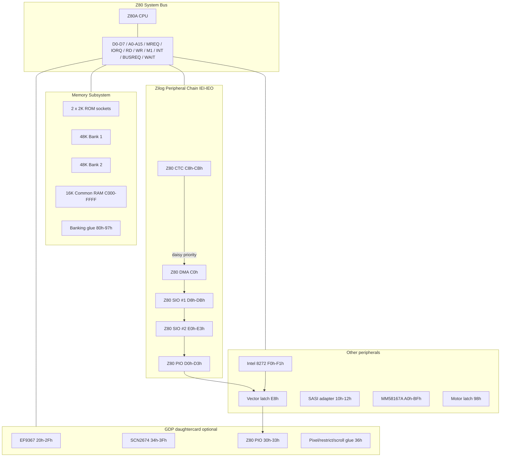

# Iskra Delta Partner — Z80 Board Schematics

_Tomaz Stih, 2026_

This document is a **reverse-engineered schematic reference** checked against
the maintained KiCad reconstructions, original drawings, firmware traces, and
`idp-emu`. It is **not** an original Iskra Delta factory design master.

Companion references:

- [PARTNER-COMPLETE-REFERENCE.md](PARTNER-COMPLETE-REFERENCE.md) — programmer view
- [Maintained KiCad schematic sources](../notes/schematics/README.md) —
  motherboard, SASI, Partner P CRT video, and Partner G GDP reconstructions
- [../notes/patterns/INTERRUPT-IM2-DAISYCHAIN.md](../notes/patterns/INTERRUPT-IM2-DAISYCHAIN.md)
- [../notes/patterns/CTC-PIO-GLUE.md](../notes/patterns/CTC-PIO-GLUE.md)

---

## 1. Design goals

A Partner-compatible board must reproduce:

| Property | Requirement |
|----------|-------------|
| CPU | Z80A, IM2, `/NMI` optional (ROM uses `DI` early) |
| Memory | Two 2 KiB ROM sockets + 2×48 KiB banked + 16 KiB common |
| I/O map | Ports as in §4 (low 8 bits of I/O address) |
| Daisy chain | CTC → DMA → SIO#1 → SIO#2 → motherboard PIO → FDC glue → expansion |
| FDC IRQ | Discrete daisy-compatible latch/glue; vector latch at `0xE8..0xEF` |
| Storage | Intel 8272 floppy + Xebec S1410 SASI adapter |
| RTC | MM58167A + battery-backed NVRAM `0xA8..0xAF` |

Variants:

- **CRT (P)** — serial console on SIO#1 channel A
- **GDP (G)** — daughtercard: EF9367 + SCN2674 + local PIO

---

## 2. System block diagram



---

## 3. CPU sheet (U1 — Z80A)

### 3.1 Bus connections

| Z80 pin group | Net | Loads |
|---------------|-----|-------|
| D0..D7 | `D0..D7` | All RAM, ROM, I/O (tristate bus) |
| A0..A15 | `A0..A15` | Memory decode, I/O decode |
| `/MREQ` | `MREQ*` | Memory CS PAL |
| `/IORQ` | `IORQ*` | I/O CS PAL |
| `/RD`, `/WR` | `RD*`, `WR*` | Memory + I/O |
| `/M1` | `M1*` | IM2 vector fetch; DMA `/BUSACK` timing |
| `/INT` | `INT*` | Open-collector wired-OR (see §6) |
| `/NMI` | `NMI*` | MM58167 interrupt through inverter/JJ12 option |
| `/BUSREQ` | `BUSREQ*` | From Z80 DMA |
| `/WAIT` | `WAIT*` | Pull-up; assert for slow devices if needed |
| `/RESET` | `RESET*` | Power-on + `/RESET` button |
| CLK | `CPUCLK` | 4 MHz system clock |

### 3.2 Bus arbitration

```
Z80 DMA /BUSREQ ──► Z80 /BUSREQ
Z80 DMA /BUSACK ◄── glue ◄── Z80 /BUSACK out
```

When DMA owns the bus, CPU is parked. DMA transfers target RAM or I/O ports
(`0xF1` FDC data, `0x11` SASI data) per firmware setup.

---

## 4. Memory subsystem

### 4.1 Address map

```
    0000 ───────────────────────── BFFF   48 KiB BANKED (RAM bank 1 or 2)
    C000 ───────────────────────── FFFF   16 KiB COMMON (always upper RAM)
```

| Region | Size | Select |
|--------|------|--------|
| `0x0000..0x1FFF` | 8 KiB window | ROM overlay **or** banked RAM |
| `0x2000..0xBFFF` | 40 KiB | Banked RAM only |
| `0xC000..0xFFFF` | 16 KiB | Common RAM (no banking) |

ROM sockets E51 and E50 each cover **2 KiB**. E51 selects
`0x0000..0x07FF`, and E50 selects `0x0800..0x0FFF`. No ROM output is selected
at `0x1000..0x1FFF`; there is no 2 KiB mirroring. The whole low 8 KiB remains
write-protected until the overlay is disabled.

### 4.2 Banking glue (ports `0x80..0x97`)

**Critical behavior:** both **IN and OUT** to these ports update flip-flops.

| Port range | Function |
|------------|----------|
| `0x80..0x87` | `ROM_OVERLAY*` ← 0 (disable ROM, expose RAM at low 8K) |
| `0x88..0x8F` | `RAM_BANK_SEL` ← 1 |
| `0x90..0x97` | `RAM_BANK_SEL` ← 2 |

Suggested decode (8-byte windows on A3..A0):

```
IORQ* · /A7 · /A6 · A5 · /A4 · (any A3..A0)  →  ROM_OVERLAY_EN*
IORQ* · /A7 · /A6 · A5 ·  A4 · /A3 · (any A2..A0) → BANK1*
IORQ* · /A7 · /A6 · A5 ·  A4 ·  A3 · (any A2..A0) → BANK2*
```

Read data: return `0xFF` on banking ports (open-bus pull-ups elsewhere too).

### 4.3 Memory decode PAL (conceptual)

```
                    ┌─────────────┐
   A15..A13 ───────►│             │
   MREQ* ───────────►│  MEM DECODE │──► ROM_CS*
   ROM_OVERLAY* ────►│     PAL     │──► RAM_BANK1_CS*
   RAM_BANK_SEL ────►│             │──► RAM_BANK2_CS*
   A15 (A15=1) ─────►│             │──► COMMON_CS*
                    └─────────────┘
```

Equations (conceptual):

| Signal | Condition |
|--------|-----------|
| `ROM_CS` | `MREQ* · RD* · ROM_OVERLAY · (A15·A14·A13 = 000)` |
| `RAM_B1_CS` | `MREQ* · /ROM_OVERLAY_or_high_addr · BANK=1 · /COMMON` |
| `RAM_B2_CS` | `MREQ* · /ROM_OVERLAY_or_high_addr · BANK=2 · /COMMON` |
| `COMMON_CS` | `MREQ* · A15` (i.e. `0xC000..0xFFFF`) |

Writes to `0x0000..0x1FFF` while `ROM_OVERLAY=1` are **discarded** (write inhibit
to RAM in overlay window).

### 4.4 RAM/ROM parts (example BOM)

| Ref | Part | Size | Notes |
|-----|------|------|-------|
| U2 | 2716/2816 or EEPROM | 2 KiB | Boot ROM |
| U3,U4 | 62256 or 2×43256 | 32 KiB×2 or 64K | Banked arrays (48K used) |
| U5 | 62256 | 32 KiB | Common 16K at top |

---

## 5. I/O decode sheet

Emulator uses **low 8 bits** of I/O address (`port & 0xFF`). Upper address bits
are ignored in emulation — hardware likely ties `A8..A15` don't-care.

### 5.1 Master I/O map

| A7..A0 | Device | A0/A1 sub-decode |
|--------|--------|------------------|
| `10h..1Fh` | SASI adapter | A1:A0 function; A3:A2 ignored |
| `20h..2Fh` | EF9367 (GDP) | `A0..A3` → register |
| `30h..33h` | GDP PIO | same as main PIO |
| `34h..3Fh` | SCN2674 AVDC | see §8 |
| `80h..97h` | Banking | §4.2 |
| `98h..9Fh` | FDC motor latch | A2:A0 ignored |
| `A0h..BFh` | MM58167A | `port - A0` → reg index |
| `C0h..C7h` | Z80 DMA data | A2:A0 ignored |
| `C8h..CFh` | Z80 CTC ch0..3 | A1:A0 channel; A2 ignored |
| `D0h..D7h` | Z80 PIO | A1:A0 register; A2 ignored |
| `D8h..DFh` | Z80 SIO #1 | A1:A0 register; A2 ignored |
| `E0h..E7h` | Z80 SIO #2 | A1:A0 register; A2 ignored |
| `E8h..EFh` | FDC vector latch | A2:A0 ignored; write-only to firmware |
| `F0h..F7h` | i8272 | A0=0 status, A0=1 data; A2:A1 ignored |

Undecoded I/O reads return **`0xFF`**.

### 5.2 Zilog family local decode (shared pattern)

For CTC, PIO, SIO — port bit map:

| A1 | A0 | Selection |
|----|----|-----------|
| 0 | 0 | Channel/port A **data** |
| 0 | 1 | Channel/port A **control** |
| 1 | 0 | Channel B **data** |
| 1 | 1 | Channel B **control** |

SIO channel select pins:

| Port | `/CS_A` | `/CS_B` | Meaning |
|------|---------|---------|---------|
| `x8`, `x0` | 0 | 0 | Ch A data |
| `x9`, `x1` | 1 | 0 | Ch A control |
| `xA`, `x2` | 0 | 1 | Ch B data |
| `xB`, `x3` | 1 | 1 | Ch B control |

---

## 6. Interrupt architecture

### 6.1 Zilog daisy chain (IEI / IEO)

Physical wiring — **highest priority closest to +5V on IEI**. The i8272 is
not itself a Zilog daisy-chain part, but discrete Partner glue inserts its
latched request after the motherboard PIO. The expansion IEI/IEO connection
continues the chain, with the GDP-local PIO last on Partner G:

```
+5V
 │
 ▼ IEI
┌────────┐    ┌────────┐    ┌─────────┐    ┌─────────┐    ┌────────┐    ┌──────────┐    ┌─────────┐
│Z80 CTC │───►│Z80 DMA │───►│Z80 SIO#1│───►│Z80 SIO#2│───►│main PIO│───►│FDC latch │───►│GDP PIO  │
└────────┘    └────────┘    └─────────┘    └─────────┘    └────────┘    └──────────┘    └─────────┘
```

Tick/service order in the emulator follows that priority:
**CTC → DMA → SIO1 → SIO2 → motherboard PIO → FDC glue → expansion PIO**.

Each chip:

| Pin | Connection |
|-----|------------|
| `/INT` | Open-drain to `INT*` bus |
| `IEI` | From upstream `IEO` (or +5V for DMA) |
| `IEO` | To downstream `IEI` |
| `IORQ`, `/M1` | Shared; vector byte on data bus during INT ack |

### 6.2 Intel 8272 discrete daisy-chain glue

```
i8272 /INT ──► request latch ──► priority/IEI glue ──► Z80 /INT
Port E8h write ──► 8-bit vector latch ──► IM2 vector low byte on ack
CPU RETI ────────► release in-service latch
```

On IM2 acknowledge, the glue supplies the vector latch (commonly `0x18` in
the CRT ROM), enters an in-service state, blocks lower-priority expansion
requests, and releases that state on RETI.

### 6.3 GDP display interrupts and optional CTC channel 3 clock

The EF9367 active-low interrupt drives GDP PIO `ASTB`. The conditioned AVDC
active-low interrupt drives GDP PIO `BSTB`; it is also available through the
board option that feeds CTC channel 3. Neither signal is a PIO Port A data bit,
and raw AVDC vertical blank is not injected directly into CPU `/INT`.

Schematic option (GDP):

```
EF9367 /IRQ ───────────────────────► GDP PIO ASTB
AVDC /IRQ ──► conditioning PAL ────► GDP PIO BSTB
                              └────► optional CTC CLKTRG3
```

### 6.4 IM2 vector table

Firmware sets `I` register to vector page (CRT boot: `I=0x02`, table ~`0x0218`).

Observed CRT ROM vectors:

| Vector | Handler role |
|--------|--------------|
| `0x18` | FDC |
| `0x1A` | HDD / SASI |
| `0x1C` | CTC / SIO |

PartOS kernel uses CTC base `0x88` (ch3 VBL = `0x8E`), HD DMA `0x90`, FDC `0xE8`.

---

## 7. Peripheral sheets

### 7.1 Z80 DMA (U6) — port `0xC0`

| Signal | Connection |
|--------|------------|
| `/CE` | I/O decode `C0h` |
| D0..D7 | Data bus |
| `/BUSREQ`, `/BUSACK` | CPU bus arbitration |
| `RDY` | E34 OR: latched FDC DRQ or inverted expansion `DMARQ-` |
| IEI | ← CTC IEO |
| IEO | → SIO #1 IEI |

Used for floppy and HDD sector transfers.

Partner ROM writes standard Z8410 register streams. It selects byte mode,
active-high ready, and CE-only operation. Byte mode releases `BUSREQ` after
each byte; burst mode releases it when ready drops after completing the current
byte; continuous mode retains the bus while waiting. E33 pin 16 is
`CE/WAIT`, while ready is E33 pin 25.

### 7.2 Z80 CTC (U7) — ports `0xC8..0xCF`

| Ch | Port | Clock input | Typical use |
|----|------|-------------|-------------|
| 0 | C8/CC | `XX1` from MC14411 F13 (1600 Hz) | System timer; **ZCTO0 → ch1** |
| 1 | C9/CD | `CLKTRG1` ← ZCTO0 | Floppy motor timeout |
| 2 | CA/CE | E67 pin 21 unconnected | Spare |
| 3 | CB/CF | optional `CLKTRG3` ← conditioned `AVDINT-` | Display event counter |

Motor timeout glue (`partner.cpp`):

```
CTC ch0 ZCTO0 ──► CTC ch1 CLKTRG1
CTC ch1 ZCTO1 ──► E91 OR + E94 inverter ──► motor-latch /CLR
```

Port `98h`:

| Direction | Function |
|-----------|----------|
| OUT | Motor on (all drives) |
| IN bit0 | Motor running status |

### 7.3 Z80 SIO #1 (U8) — `0xD8..0xDF`

| Channel | Partner role |
|---------|--------------|
| A | **Fixed internal** — CRT: terminal; GDP: keyboard |
| B | External serial (RS-232) |

Modem inputs: `/DCD`, `/CTS`, `/RXCA`, `/RXCB` per channel (keyboard or terminal
bit streams in emulator).

### 7.4 Z80 SIO #2 (U9) — `0xE0..0xE7`

Both channels available for mouse, terminal, modem, etc. (NVRAM-configured).

### 7.5 Z80 PIO (U10) — `0xD0..0xD7`

Centronics printer, Covox audio, general parallel on Port A/B.

Emulator routes Port A/B to virtual printer and Covox when configured in NVRAM.

### 7.6 Intel 8272 FDC (U11)

| Port | Function |
|------|----------|
| F0h | MSR read (status) |
| F1h | Data FIFO |
| 98h | Motor latch (board glue) |
| E8h | IM2 vector latch |

| Signal | Connection |
|--------|------------|
| `/INT` | Discrete request/in-service daisy glue (§6.2) |
| `DRQ`/`DACK` | E107 request latch and E34 DMA-ready/acknowledge glue |
| `TC` pin 16 | E108 AND of `BUSAK+` and inverted DMA `INT1-`/EOB pulse |
| Drive 0..3 | 34-pin floppy connectors |

The TC connection is why a Partner floppy transfer completes on the DMA block
boundary. It is not correct to finish an 8272 command simply after copying one
emulator sector. The GDP ROM additionally exposes the physical propagation
order: for its one-sector command with `EOT=R`, ST1.EN remains visible at the
DMA terminal-count boundary while ST0 reports normal completion.

### 7.7 SASI adapter (U12) — `0x10..0x1F`

Xebec S1410 protocol bridge:

| Port | Function |
|------|----------|
| 10h | Status: D7 REQ, D6 IO, D5 MSG, D4 CD, D3 BSY |
| 11h | Data |
| 12h | Reset (out); read floats high |
| 13h | Unused; read floats high |

The same four functions repeat at `14h`, `18h`, and `1Ch` because A2 and A3
are not decoded. DMA can stream to/from the data function when DRQ is asserted.

### 7.8 MM58167A RTC/NVRAM (U13)

| Port range | Function |
|------------|----------|
| A0h..A7h | Time registers (BCD) |
| A8h..AFh | NVRAM (8 bytes, battery backed) |
| B2h | Counter reset / sync |
| BFh | Test register |

The RTC periodic/alarm `/INT` output passes through an inverter and optional
link JJ12 to CPU `/NMI`. The emulator leaves JJ12 open by default, matching the
standard CP/M system whose `0066h` vector is not an RTC handler. Reading
interrupt status clears the latched source.

---

## 8. GDP daughtercard (optional)

Present on **G** models only. Connects to main board D0..D7, IORQ, RD, WR.

### 8.1 EF9367 graphics (U20) — `0x20..0x2F`

| Port | Register |
|------|----------|
| 20h | Command |
| 21h | CR1 |
| 22h | CR2 |
| 23h | CHSZ |
| 25h/27h | DX/DY |
| 28h..2Bh | X/Y address |
| 2Fh | Status |

Video RAM: separate bitmap memory (1024×512 or 1024×256 depending on mode).

### 8.2 SCN2674 AVDC (U21) — `0x34..0x3F`

| Port | Function |
|------|----------|
| 34h | Character latch |
| 35h | Attribute latch |
| 38h | Init/data |
| 39h | Command/status |
| 3Ah..3Fh | Screen start, cursor, screen 2 |

Ports `36h`/`37h` on AVDC are **inert**; board uses `36h` for glue instead.

### 8.3 GDP local PIO (U22) — `0x30..0x33`

Port A bit map (board control):

| Bit | Name | Dir | Function |
|-----|------|-----|----------|
| 0 | RBNK | Out | EF9367 read bank |
| 1 | WBNK | Out | EF9367 write bank |
| 2 | XORM | Out | XOR write mode; every plotted position toggles, for both pen and eraser selection |
| 3 | FM0 | Out | Format bit 0 |
| 4 | FM1 | Out | Format bit 1 |
| 5 | — | — | Not an EF interrupt-status data bit |
| 6 | — | — | Not an AVDC interrupt-status data bit |
| 7 | SCRLM | Out | Scroll mode (active low) |

EF9367 `/IRQ` and conditioned AVDC `/IRQ` reach the PIO through `ASTB` and
`BSTB`, respectively. They therefore participate in the PIO handshake and
interrupt logic rather than being sampled through Port A.

AVDC/CMAC-relevant Port B outputs:

| Bits | Function |
|------|----------|
| 0 | `CA0`; no CMAC/clock connection shown |
| 1 | SCB2675 `CMODE` cursor mode |
| 2 | SCB2675 `M/C` color/monochrome select |
| 3 | SCB2675 `ABLUEF/ABLANK` |
| 4 | SCB2675 `AGREENF/BKGND` |
| 6:5 | SCB2675B `C1:C0` character divider (`00`=10, `01`=7, `10`=8, `11`=9 dots/character) |
| 7 | AVDC dot-clock path (`0`=18 MHz, `1`=24 MHz) |

The AVDC character clock is therefore `DCLK / dots-per-character`; both the
clock selection and divider affect raster timing, not just rendering width.
Exact register decodes, interlace/split behavior, and GDP/AVDC command-cycle
cases are recorded in
[`GDP-AVDC-CMAC-TIMING.md`](../notes/patterns/GDP-AVDC-CMAC-TIMING.md).

The character generator has a 2 KiB writable character RAM. Attribute bit 2
selects it instead of the character ROM, providing 128 user-defined characters
with 16 scan-line bytes each. Character RAM is addressed as
`0x2000 + (character & 0x7f) * 16 + line`; its board wiring swaps D0 and D7.
The complete programming procedure and a runnable CP/M example are in
[`AVDC-UDG.md`](../notes/patterns/AVDC-UDG.md).

CMAC `DOTS` is driven by attribute-data bit 3 (`ATTD3`). The SCB2675 samples
this signal on the falling edge of `BLANK`, so it controls the entire following
scan line. It is not a per-character attribute and is separate from the
PIO-controlled dots-per-character divider.

### 8.4 Board glue — port `0x36`

| Direction | Function |
|-----------|----------|
| Read bit4 | `RESTRICT`: DADD13/last-line value latched by IC26 (74S374) at falling `BLANK`; high throughout the last scan line of a character row |
| Read bit7 | Active-low GDP pixel latched by IC1 (74LS74) when EF9367 command `0Fh` completes its next-free `MW` memory cycle |
| Write | Scroll latch |

Bit 4 is not HSYNC. With row-table addressing enabled, the SCN2674 uses
the blanking interval of the last scan line to fetch the next row address.
Software waits for bit 4 to go high and then low before accessing the AVDC,
thereby beginning its access sequence at line zero of the following row.

The GDP path is only one bit wide. IC68/IC70 and IC24 select `DOUT` from the
graphics RAM outputs, IC22 derives `LOAD` from `MW`, and IC15 gates the IC1
latch onto CPU D7. The original `CGRAF.COM` issues `0Fh`, polls EF READY at
`2Fh`, reads `36h`, then inverts D7. No GDP byte or word is connected to the
CPU bus.

---

## 9. CRT vs GDP wiring differences

| Signal path | CRT (P) | GDP (G) |
|-------------|---------|---------|
| SIO#1 Ch A | CRT terminal (serial video) | GDP keyboard |
| SIO#1 Ch B | External serial | External serial |
| Display | Terminal emulator / RS-232 | EF9367 + AVDC composite |
| Extra I/O | — | `20h..3Fh` |
| Display interrupt | — | EF `/IRQ` → PIO ASTB; conditioned AVDC `/IRQ` → PIO BSTB and optional CTC ch3 |

Main board schematic is **identical** except GDP connector and ROM image.

---

## 10. KiCad implementation checklist

### 10.1 Suggested sheet structure

1. **CPU** — Z80A, clock, reset
2. **BUS** — Data/addr buffers, `/INT` pull-up, DMA arbitration
3. **MEM** — ROM, RAM banks, banking FFs, MEM decode PAL/GAL
4. **IO_DECODE** — I/O PAL (16L8 or 22V10), `/IORQ` gated selects
5. **INTERRUPT_CHAIN** — CTC, DMA, SIO×2, PIO, FDC glue, expansion IEI/IEO
6. **STORAGE** — 8272, SASI, motor latch, vector latch
7. **RTC** — MM58167A, battery, 32 kHz crystal
8. **GDP_CARD** — optional hierarchical sheet

### 10.2 Critical nets to label

```
D0..D7, A0..A15, MREQ*, IORQ*, RD*, WR*, M1*
INT*, RESET*, CPUCLK
IEI_CTC, IEO_CTC, IEI_DMA, IEO_DMA, ... IEO_PIO, IEI_FDC, IEO_FDC
ROM_OVERLAY*, RAM_BANK_SEL[1:0]
ROM_CS*, RAM_B1_CS*, RAM_B2_CS*, COMMON_CS*
FDC_INT*, FDC_VEC[7:0]
MOTOR_ON, CTC_ZCTO0, CTC_ZCTO1
```

### 10.3 Design rules

- Use **open-collector** or tristate for `/INT` wired-OR
- Banking ports are **read-sensitive** — do not optimize away IN cycles
- ROM overlay write-inhibit must be hardware-real (not firmware-only)
- Preserve the FDC request/in-service/RETI glue between motherboard PIO and expansion IEI
- Tie undecoded I/O reads to `0xFF` (pull-ups on data bus)

### 10.4 Still requiring physical confirmation

- Exact crystal frequency and wait-state generation
- Full MEM/I/O PAL Boolean equations (only port ranges are verified)
- Original connector pinouts (Centronics, RS-232, floppy)
- The fitted state of option links such as RTC interrupt-to-NMI JJ12 on each machine
- Physical SASI flat-cable pinout

---

## 11. Verification against emulator

Build and run emulator tests after any schematic-derived firmware:

```bash
cmake -S . -B tests/dump/build && cmake --build tests/dump/build -j4
cd build && ctest --output-on-failure
```

Key behavioral tests:

- ROM overlay disable via `OUT (80h),A`
- Bank switch via `88h` / `90h`
- IM2 boot and FDC interrupt (`tests/test_z80sio.cpp`, BIOS probes)
- GDP AVDC/EF path (`tests/test_partos_bios_probe_gdp.cpp`)

---

## 12. Source index

| Topic | File |
|-------|------|
| I/O map, banking, tick order | `src/partner.cpp` |
| FDC non-daisy INT | `src/partner.cpp` (`service_fdc_daisy`) |
| GDP I/O | `src/partner_gdp.cpp` |
| CRT SIO routing | `src/partner_crt.cpp` |
| CTC channels | `partos/include/ctc.h` |
| Programmer reference | `docs/books/PARTNER-COMPLETE-REFERENCE.md` |
| Maintained KiCad reconstructions | `docs/notes/schematics/README.md` |

---

## Revision history

| Date | Change |
|------|--------|
| 2026-06-17 | Initial emulator-derived schematic reference |
| 2026-08-26 | Indexed maintained motherboard, SASI, CRT-video, and GDP KiCad sources |
