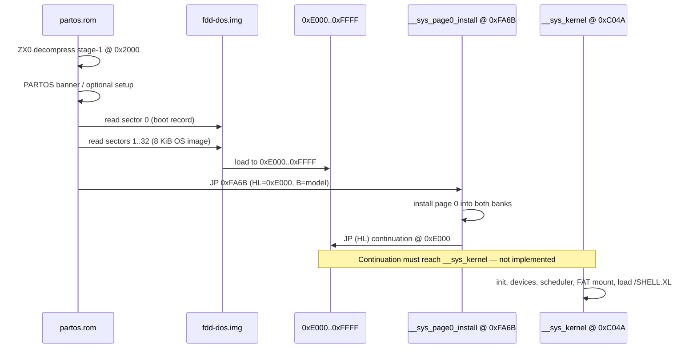

# PartOS Boot Investigation — Issues

Research date: 2026-06-19  
Scope: full PartOS tree (`partos/`) and Iskra Delta Partner emulator (`src/`, `lib/chipsex/`, tests, disk tooling)

This document records what was found while investigating why PartOS does not boot end-to-end under the default VS Code configuration (**PartOS GDP Floppy**: `partos/bin/partos.rom` + `disks/fdd-dos.img`).

---

## Executive Summary

**PartOS does not boot as a complete operating system today.** The failure is not a single bug in one file; it is a chain of missing contracts and size constraints between three layers:

1. **ROM firmware** — works in isolation (decompress, banner, setup menu, raw sector loader).
2. **Disk image format** — bootable FAT volume exists, but the 8 KiB OS staging area is empty.
3. **Kernel image** — real and substantial (~16 KiB), but larger than the ROM load window and not packed into disk images.

The emulator’s hardware path (FDC/DMA, memory banking, ROM overlay, IM2, GDP display) is largely functional. Passing unit/integration tests prove individual stages. **F5 boot dies after the ROM hands off to kernel code that is not present in RAM at the expected addresses.**

---

## Boot Flow (What Should Happen)



---

## What Works Today

| Stage | Status | Evidence |
|-------|--------|----------|
| ROM stage-0 bootstrap + ZX0 inflate | OK | `partos.bin/partos.rom` builds; banner tests pass |
| Model detect, NVRAM repair, setup menu | OK | `test_partos_boot_banner`, `test_partos_bios_menu_*` |
| FDC sector read + DMA into RAM | OK | `idp-bootload-probe` (fd + hd paths) |
| Boot record signature check (`0x55AA`) | OK | `disks/fdd-dos.img` sector 0 valid |
| Kernel init when direct-loaded at link base | OK | `idp-kernel-probe` phase 1 |
| Device enumeration from NVRAM | OK | probe lists `ctc,ttyS*,pio*,rtc,nvram,fd0..fd2` |
| FDC recal/read from kernel driver | OK | probe: `fd_open=1 recal=1 wait_int=1 got_int=1` |
| FAT worker starts, reads boot sector | OK | probe depth 6/10 (partial) |

**CTest summary (18 tests):** 14 pass, 4 fail — failures are stale test harness symbols/paths, not new emulator regressions (see §7).

---

## P0 — Boot Blockers (Why F5 Hangs)

### 1. OS staging area on disk is empty

`tools/mkdosdisk.py` intentionally zero-fills sectors 1..32 (8 KiB reserved for the OS). `disks/fdd-dos.img` has a valid BPB and `0xAA55` signature, but **0 nonzero bytes** in the staging region.

After the ROM loads sectors 1..32 into `0xE000..0xFFFF`, that RAM is all `0x00` (Z80 `NOP`).

### 2. ROM jumps to absolute linked addresses, not a relocatable image

`partos/src/rom/start.s` handoff:

```asm
ld  hl,#OS_LOAD_BASE    ; 0xE000
ld  a,(model)
ld  b,a
jp  SYS_PAGE0_INSTALL   ; fixed 0xFA6B
```

`SYS_PAGE0_INSTALL` = `KERNEL_PAGE0_INSTALL` = **`0xFA6B`** (`partos/src/partos.inc`).

The ROM does **not** jump to `HL`. It jumps to the **absolute** page-0 installer address inside the loaded image. That only works if the bytes at `0xFA6B` in RAM are the real `__sys_page0_install` code from `partos/src/kernel/page0.s`.

With an empty staging area, execution lands on a NOP slide at `0xFA6B` and never installs page 0 or reaches the kernel.

### 3. Kernel image is ~16 KiB; ROM only loads 8 KiB

| Item | Value |
|------|-------|
| `kernel.bin` size | **16,310 bytes** |
| Link base `__sys_kernel` | **`0xC04A`** |
| ROM load window | **`0xE000..0xFFFF`** (8 KiB, sectors 1..32) |
| `__sys_page0_install` | **`0xFA6B`** (inside top 8 KiB) |
| `__sys_kernel` entry | **`0xC04A`** (below load window — never loaded by ROM) |

Even if the **top 8 KiB** of `kernel.bin` were copied into reserved sectors (so `0xFA6B` contained the real installer), the ROM still sets **`HL = 0xE000`** as the post-install continuation. After page-0 install, control would land at **`0xE000`**, which today is **middle of FAT worker code** (`fat_decode` / `fat_queue` region per `partos/build/kernel.map`), not `__sys_kernel`.

**There is no trampoline or entry stub at `0xE000`.** This is the missing formal contract called out in `partos/docs/PARTOS-VOLUME-3-OS.md` and `partos/docs/CHANGELOG.md`.

### 4. No tool packs `kernel.bin` into disk images

`mkdosdisk.py` builds FAT12 superfloppies with correct Partner geometry (`256`-byte sectors, 33 reserved sectors) and places `/SHELL.XL` in the data area, but **never embeds OS code** into sectors 1..32.

---

## P1 — Kernel Runtime Gaps (After ROM Handoff Is Fixed)

### 5. GDP VBL interrupt does not fire during kernel execution

The kernel sets `I = 0xFD` (`KERNEL_IM2_BASE = 0xFE00`). The round-robin scheduler depends on CTC ch3 / vector `0x8E` VBL ticks (`partos/src/kernel/init.s`, `partos/include/ctc.h`).

In `src/partner_gdp.cpp`, external VBL injection is gated on:

```cpp
if (avdc_vb_edge_ && cpu.i == 0xFA && avdc_char_nonspace_wr_cnt_ > 0)
```

`0xFA` is the **BIOS** IM2 page. After the kernel takes over (`I = 0xFD`), **no VBL is delivered on the GDP model**. The scheduler and async FAT worker stall without ticks.

`src/probe_kernel.cpp` works around this with a custom `kernel_probe_partner` that injects VBL when `I == 0xFD`. The production `partner_gdp` path used by F5 does not.

### 6. FAT boot path incomplete in kernel probe

`idp-kernel-probe` (direct kernel load, synthetic VBL) reaches **partial** boot (6/10 milestones):

- Reaches: bootstrap thread, `_fat_mount`, `__fat_init`, FAT worker, `fat_dev_open`, `fd_read`
- Does not reach: `_fat_open`, `_fat_read`, `_process_load_image`

So even bypassing the ROM, **shell load does not complete** within the probe budget. Likely areas: async mount completion / event signaling, or a remaining FAT-layer edge case. Recent fixes in `partos/src/os/fat.s` (stack ordering in `fat_dev_call3$`, read/write dispatch in `fat_xfer_block$`) address real bugs that would have made this worse; completion still needs debugging.

### 7. `/SHELL.XL` is a dummy halt stub, not a real shell

`mkdosdisk.py` places a minimal 256-byte XL image (halt loop) at `/SHELL.XL`. `partos/src/apps/shell/` has no real shell binary. Even a fully working FAT path would only start an idle stub.

---

## P2 — ABI, Layout, and Documentation Drift

### 8. ROM handoff register contract is incomplete

`__sys_page0_install` (`page0.s`) expects:

| Register | Meaning |
|----------|---------|
| `A` | version |
| `B` | model |
| `C` | flags |
| `D` | meta1 |
| `HL` | continuation |

The ROM only meaningfully supplies **`B = model`** and **`HL = 0xE000`**. `A` accidentally holds the model byte; `C`/`D` are uninitialized. `__sys_version`, `__sys_flags`, and `__sys_meta1` get garbage.

### 9. Documentation describes an older, smaller kernel

Written docs still cite values from an earlier link map:

| Doc claim | Live build (`partos/build/kernel.map`) |
|-----------|----------------------------------------|
| `kernel.bin` = 6120 bytes | **16,310 bytes** |
| `_CODE` @ `0xE818` | **`0xC04A`** |
| `__sys_page0_install` @ `0xFF6B` | **`0xFA6B`** |
| `_PAGE0` @ `0xFF00` | **`0xFA00`** |
| `_IM2` = 256 bytes | **512 bytes** |

Affected files: `partos/docs/PARTOS-VOLUME-1-ROM.md`, `PARTOS-VOLUME-2-KERNEL.md`, `PARTOS-VOLUME-3-OS.md`, `partos/docs/CHANGELOG.md`, `partos/src/kernel/README.md`.

### 10. `sdb` configured in ROM setup but not published by kernel

ROM BIOS setup exposes `sda` and `sdb`. `__dev_probe_all` in `partos/src/drivers/dev.s` only appends `hd_dev0` for the SDA NVRAM mask bit — **`sdb` is never registered**.

### 11. ISR stack and kernel stack share the same base

`partos/src/partos.inc` assigns both `DRV_ISR_STACK_TOP` and `KERNEL_STACK_BASE` to **`0xFD80`** (128-byte windows). ISRs (`partos/src/drivers/drv.s`) and kernel entry (`init.s`) can collide under interrupt load.

### 12. Boot device identity not passed ROM → kernel

`_kernel_bootstrap` (`partos/src/os/boot.s`) re-probes `fd0` then `sda`, mirroring ROM policy, instead of using the device that actually booted.

---

## Emulator-Specific Notes

### Hardware emulation is largely not the blocker

The customized i8272 model in `lib/chipsex/intel/i8272.h` implements Partner-specific semantics (ST0/ST1 expectations, delayed IRQs, reset IRQ deferred until `OUT (0xE8)`). Integration in `src/partner.cpp` handles:

- ROM overlay disable via `OUT (0x80)`
- RAM bank switching (`0x88` / `0x90`)
- FDC request/in-service daisy glue and vector latch aliases `0xE8..0xEF`
- DMA `RDY` gated on FDC execute phase for port `0xF1`
- NVRAM shadow file backing RTC ports `0xA8..0xAF`

`idp-bootload-probe` confirms byte-exact loading of boot record + 8 KiB OS image to `0xDF00` / `0xE000`.

### FDC handoff when skipping ROM

`probe_kernel.cpp` documents that skipping the ROM leaves a stale i8272 reset interrupt. The harness calls `clean_fdc_handoff()` to match real hardware state. Any future direct-load or test path must do the same.

### CTC channel 3 display source

The GDP board exposes its conditioned active-low `AVDINT-` signal, not raw
AVDC vertical blank, to the optional CTC `CLKTRG3` connection. EF and AVDC
interrupts also drive the GDP-local PIO `ASTB` and `BSTB` handshake pins; no
BIOS-only direct IM2 injection is used.

---

## Test Harness / CI Drift

Four CTest targets fail due to **stale references**, not boot regressions:

| Test | Failure |
|------|---------|
| `partos_bios_probe` | Looks for `dev_list` in `partos.map` — kernel uses `_dev_first` (`dev.s`) |
| `partos_bios_probe_gdp` | Same |
| `partos_bios_rtc` | Same |
| `partos_print` | Makefile references deleted `partos/src/bios/core/dev.s` |

`dev_list` exists only in small test harness ROMs under `tests/partos_*`, not in the live PartOS kernel map.

Passing tests (`partos_boot_banner`, `partos_bios_menu_*`, `partos_kernel_boot`) do **not** exercise the full F5 path (ROM → disk load → kernel entry with real `fdd-dos.img`).

`idp-bootload-probe` redirects PC to `boot_fd_path` and patches NVRAM — it validates the loader in isolation, not the interactive F5 boot sequence.

---

## Memory Map (Live Kernel)

From `partos/build/kernel.map` and `partos/src/partos.inc`:

```
0x0100..0xBFFF   user heap (USER_HEAP_SIZE = 0xBF00, top 0xC000)
0xC04A..0xF6C5   _CODE (13,947 bytes) — __sys_kernel @ 0xC04A
0xF6C5..0xF84D   _INITIALIZED (393 bytes)
0xF84E..0xF9FF   _SYSVARS (434 bytes) — FAT scratch, boot vars
0xFA00..0xFAFF   _PAGE0 (256 bytes) — __sys_page0_install @ 0xFA6B
0xFB00..0xFCFF   _HEAP (512 bytes, kernel heap)
0xFD80..0xFDFF   ISR stack / kernel stack (shared base — see §11)
0xFE00..0xFFFF   _IM2 vector table (512 bytes)
```

ROM load window `0xE000..0xFFFF` overlaps the **top 8 KiB** of this map (`0xE000..0xFFFF` ⊂ linked image). It does **not** cover `0xC04A..0xDFFF` where `__sys_kernel` and most init code live.

---

## Recommended Fix Order

1. **Define the reserved-sector OS image contract** — what lives at `0xE000` (continuation stub), how the top 8 KiB of the linked kernel is laid out, versioning.
2. **Extend `mkdosdisk.py` (or add `pack-os-image.py`)** — embed the packed image into sectors 1..32 of `fdd-dos.img` / `hdd-dos.img`.
3. **Add a continuation stub at `0xE000`** — e.g. `jp __sys_kernel` or a small relocator — so `__sys_page0_install` handoff reaches real init code.
4. **Fix GDP VBL delivery for kernel `I = 0xFD`** — inject vector `0x8E` when the kernel IM2 page is active, or drive scheduler ticks from CTC ch3 properly.
5. **Complete FAT mount → open → read → `process_load_image` path** — debug partial probe failure.
6. **Update docs and tests** — `_dev_first`, `0xFA6B`/`0xC04A`/16 KiB figures, `partos_print` paths; add one integration test for full ROM boot with a packed disk (no PC redirect).
7. **Publish `sdb`, pass boot device id, resolve stack overlap** — before treating the system as stable.

---

## Key File Reference

| Topic | Path |
|-------|------|
| F5 launch config | `.vscode/launch.json` |
| ROM boot / handoff | `partos/src/rom/start.s` |
| Page-0 installer | `partos/src/kernel/page0.s` |
| Kernel entry | `partos/src/kernel/init.s` |
| OS bootstrap thread | `partos/src/os/boot.s` |
| Memory map constants | `partos/src/partos.inc` |
| Disk image builder | `tools/mkdosdisk.py` |
| Boot load probe | `src/probe_bootload.cpp` |
| Kernel smoke probe | `src/probe_kernel.cpp` |
| Core emulator | `src/partner.cpp`, `src/partner_gdp.cpp` |
| FDC emulation | `lib/chipsex/intel/i8272.h` |
| OS volume docs | `partos/docs/PARTOS-VOLUME-*.md` |

---

## Bottom Line

The ROM is real. The kernel is real and far past a halt-loop scaffold. The emulator hardware model is good enough for bring-up. **What is missing is the glue:** a packed disk image, a continuation contract at `0xE000`, kernel-sized load policy, and GDP scheduler ticks after handoff. Until those exist, F5 will consistently fail at the ROM→kernel boundary regardless of display or keyboard activity.
