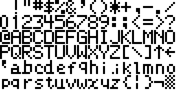

# Thomson EF9367 Font Charset

This document explains the 480-byte font file (see: `roms/charset_ef9365.rom`) for the Thomson EF9367 chip. It has 96 ASCII characters, each a 5x7 pixel bitmap.

## File Format

The font file is 480 bytes. It contains 96 characters, numbered 0 to 95, matching ASCII codes 32 to 127 (space to ~). Each character uses 5 bytes to store a 5x7 grid, where 1 is a pixel on and 0 is off.

- Size: 480 bytes.
- Characters: 96 (ASCII 32 to 127).
- Bytes per character: 5 bytes.
- Grid: 5 columns, 7 rows, 35 bits total.
- Bits: 5 bytes give 40 bits. First 35 bits make the grid, row by row, top to bottom, left to right. Last 5 bits are unused.

## How to Decode

To show a letter:

1. Read all 480 bytes.
2. Split into 96 groups of 5 bytes. Bytes 0 to 4 are character 0 (space, ASCII 32). Bytes 165 to 169 are character 33 (A, ASCII 65).
3. Take 5 bytes for a character. Get their 40 bits and keep the first 35.
4. Split the 35 bits into 7 rows:
   - Bits 0 to 4: row 1 (top).
   - Bits 5 to 9: row 2.
   - Bits 10 to 14: row 3.
   - Bits 15 to 19: row 4.
   - Bits 20 to 24: row 5.
   - Bits 25 to 29: row 6.
   - Bits 30 to 34: row 7 (bottom).
5. For each row’s 5 bits, 1 is a pixel (█), 0 is empty (space).
6. Show the 7 rows as a 5x7 grid.

## Example: Letter A

Character 33 (bytes 165 to 169, ASCII 65) is the letter A. It looks like this:

```
 ███
█   █
█   █
█████
█   █
█   █
█   █


Each row is 5 bits:
- Row 1:  ███  = 01110
- Row 2: █   █ = 10001
- Row 3: █   █ = 10001
- Row 4: █████ = 11111
- Row 5: █   █ = 10001
- Row 6: █   █ = 10001
- Row 7: █   █ = 10001
```

## The Font Viewer

This Python script, `font_viewer.py`, displays all characters as 5x7 grids:

```python
# font_viewer.py
filename = "charset_ef9365.rom"  # Replace with your file name
bytes_per_char = 5
rows_per_char = 7
bits_per_row = 5

with open(filename, "rb") as f:
    data = f.read()

for char_idx in range(0, len(data), bytes_per_char):
    char_data = data[char_idx:char_idx + bytes_per_char]
    print(f"Character {char_idx // bytes_per_char}:")
    # Unpack 35 bits (5 bytes) into 7 rows of 5 bits
    bits = ""
    for byte in char_data:
        bits += format(byte, "08b")  # Get 8 bits per byte
    bits = bits[:35]  # Take only 35 bits
    for row in range(rows_per_char):
        start = row * bits_per_row
        row_bits = bits[start:start + bits_per_row]
        if len(row_bits) < bits_per_row:
            row_bits += "0" * (bits_per_row - len(row_bits))  # Pad if needed
        print(row_bits.replace("1", "█").replace("0", " "))
    print()
```

## The Font



## Notes

- Use font_viewer.py in the `tools/` directory to see all letters.
- Character 0 is space, 33 is A, 65 is a.
